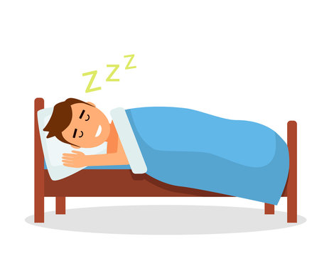
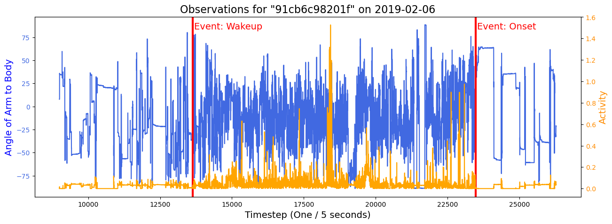

# Accelerometer_Sleep_Predictions

### Overview
The purpose of this project was to predict, as precisely as possible, the exact moment that a person fell asleep or woke up given certain biometric information. In this project, I analyzed data provided by the [Healthy Brain Network](https://healthybrainnetwork.org/) containing measurements from a wrist-worn accelorometer. This data had tracking measurements of the wearer's activity (enmo) and the angle at which their arm was positioned (anglez). These measurements were updated in 5-second intervals. 

### Data
The data included the accelerometer records from 277 different study participants. Because there were incremental 5 second observations, each day contained 17280 observations. Typically, for all of those observations there would only be 1 incident of "onset" - falling asleep - and 1 incident of "wakeup" - waking from sleep. Not all of the participants wore the accelerometers consistently, and several also had a mismatched number of onsets and wakeups. Ultimately, those people with asymetrical counts of wakeup and onset were excluded from the modeling data, leaving 269 total participants worth of data. 

### Evaluation

### Conclusion
